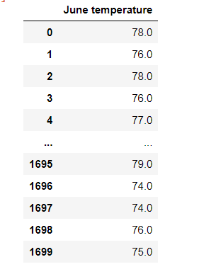
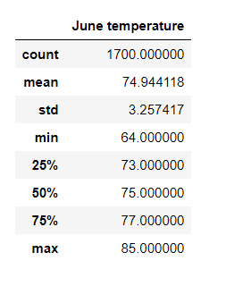
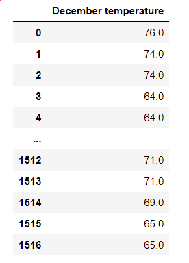
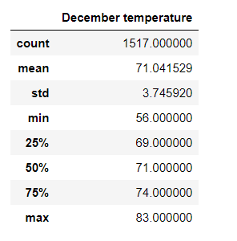

# Surfs_up analysis
## Temperature analysis for the months of June and December
This analysis is to find out if a surf and ice cream shop would be sustainable year-round on the island of Oahu. 
The analysis was performed from temperature trends on Oahu from the data gathered through out the years for the months of June and December.

The analysis was performed by pulling data from sqlalchemy (sqlite=///Hawaii.sqlite) into Python. Then a query was written to filer out the temperatures for June from the Measurement table.
Then a list comprehension was run to convert the query into a list to put it into Pandas DataFrame.
After that, the DataFrame was created for the June’s temps.  
From the DataFrame the statistics were pulled with the describe() function.  
Same procedures were performed for December’s temperatures.  

From the images above we can see that there are a few more rows of data for the month of June -1700 and for December there are only 1517 rows.  The minimum temperature for June is 64 and for December it is 56.  The maximum temp for June is 85 and for December 83.  From the max temperatures we can see that there is only a 2 degree difference between the two months, however the minimum temperatures are on the cooler side.  
